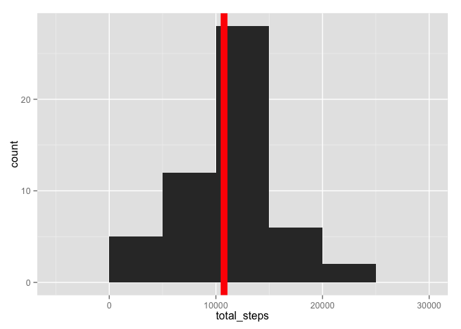
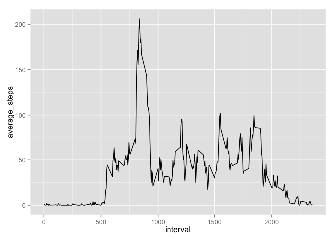
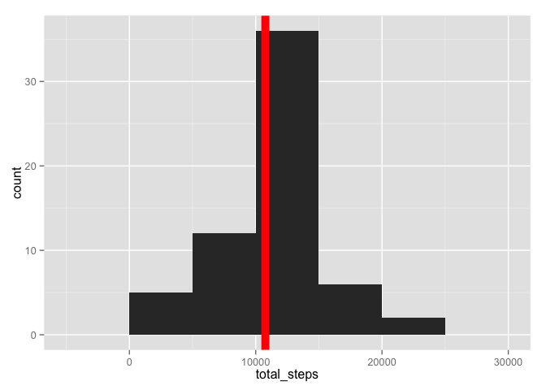
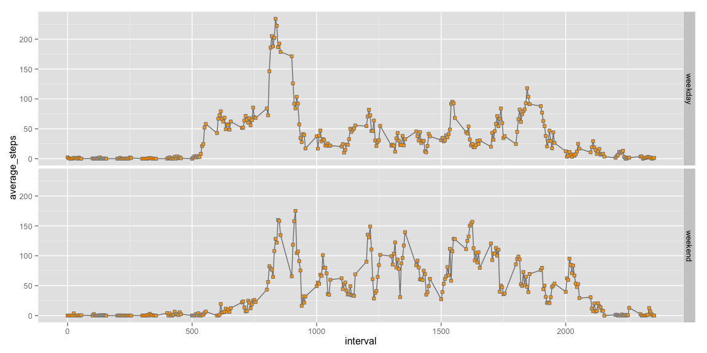

# Reproducible Research: Peer Assessment 1


## Loading and preprocessing the data

Load dependencies


```r
library(ggplot2)
library(dplyr)
```

Load data


```r
raw <- read.csv("activity.csv")
activity <- raw[complete.cases(raw), ]
act <- tbl_df(activity)
```

## What is mean total number of steps taken per day?

Calculate the total steps per day


```r
total_steps_per_day <- act %>%
  group_by(date) %>%
  summarize(total_steps = sum(steps))
```


```r
p <- ggplot(total_steps_per_day, aes(x = total_steps)) +
  geom_histogram(binwidth = 5000) +
  geom_vline(aes(xintercept = mean(total_steps), size = 1), color = "red")
p
```

 

Mean


```r
mean(total_steps_per_day$total_steps)
```

```
## [1] 10766
```

Median


```r
median(total_steps_per_day$total_steps)
```

```
## [1] 10765
```

## What is the average daily activity pattern?

Aggregate the steps by interval


```r
average_per_intervals <- act %>%
  group_by(interval) %>%
  summarize(average_steps = mean(steps))
```

Time series plot averaged across all days


```r
p <- ggplot(average_per_intervals, aes(x = interval, y = average_steps)) +
  geom_line()
p
```

 

5-min interval with the maximum number of steps


```r
arrange(average_per_intervals, desc(average_steps))[1 ,]
```

```
## Source: local data frame [1 x 2]
## 
##   interval average_steps
## 1      835         206.2
```

## Imputing missing values


```r
sum(is.na(raw$steps))
```

```
## [1] 2304
```

An strategy to choose fill the missing values could be to use the mean of the 5 minute interval

Filling missing data with the previously calculated averages per interval:


```r
missing <- is.na(raw$steps)

filling_steps <- sapply(raw[missing, ]$interval, function(x) {
  average_per_intervals[average_per_intervals$interval == x, ][[2]]
})

raw[missing, ]$steps <- filling_steps
```

Calculate the mean and median with this new dataset


```r
total_steps_per_day_2 <- raw %>%
  group_by(date) %>%
  summarize(total_steps = sum(steps))
```


```r
p <- ggplot(total_steps_per_day_2, aes(x = total_steps)) +
  geom_histogram(binwidth = 5000) +
  geom_vline(aes(xintercept = mean(total_steps), size = 1), color = "red")
p
```

 

Mean


```r
mean(total_steps_per_day_2$total_steps)
```

```
## [1] 10766
```

Median


```r
median(total_steps_per_day_2$total_steps)
```

```
## [1] 10766
```

From the graph and values, we can appreciate that the overall values didn't get affected.
The mean was sightly affected while the median didn't change.

Also the histogram remains the same.


## Are there differences in activity patterns between weekdays and weekends?


```r
library(lubridate)

act$weekday <- format(ymd(act$date), "%u")
act$day <- ifelse(act$weekday == "6" | act$weekday == "7", "weekend", "weekday")

average_per_intervals_on_weekday <- act %>%
  group_by(interval, day) %>%
  summarize(average_steps = mean(steps))
```


```r
g <- ggplot(average_per_intervals_on_weekday, aes(interval, average_steps)) +
  geom_line(color = "grey50") +
  geom_point(size = 2, shape = 22, colour = "grey50", fill = "orange") +
  facet_grid(day ~ .)
g
```

 

From the graph we can infer that there are differences in the activities between
weekdays and weekends.

During weekends we see more activities during the day, not only in the morning.
The number of steps per interval stays above 50 during the active part of the day.
